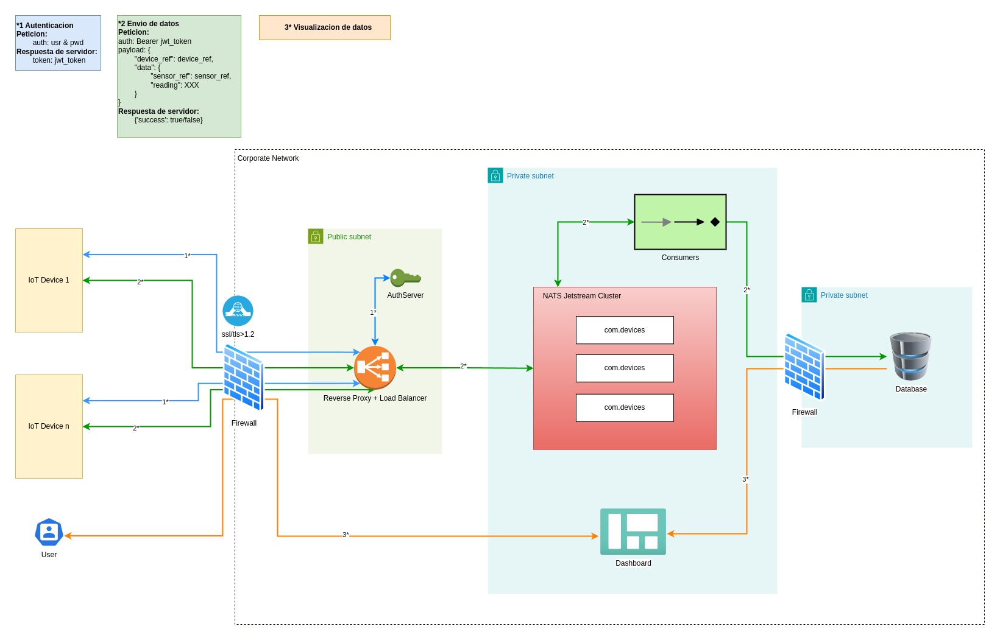

# **TAREA 2: Diseño de la arquitectura de un software de lectura de sensores**

Se pretende evaluar la capacidad del candidato para diseñar una aplicación de lectura de múltiples
sensores de diferente tipo, de modo que mediante mensajería se puede consultar la información de los
sensores (o configurar aspectos de su funcionamiento) y la información se almacena en una base de datos.

## Descripción de la tarea

El propósito de esta tarea es desarrollar pseudo-código (no es necesario que se ejecute correctamente ni
importar librerías específicas para la implementación), el cual debe ilustrar la arquitectura de la aplicación
diseñada. Es posible acompañar este pseudo-código con algún tipo de diagrama que ayude a entender la
estructura.

## Restricciones

♦ Se tienen diferentes tipos de sensores (infrarrojo, ambiental, etc) y es posible tener varios
sensores del mismo tipo en el mismo dispositivo. La selección de estos sensores se realiza en el
momento de la ejecución del programa.
♦ Debido a que cada sensor es de diferente índole, cada uno de ellos presenta una estructura de
datos diferente para su configuración (esta estructura no está definida en esta tarea)

# Solucion propuesta

Se adjunta un diagrama de arquitectura donde se muestran los elementos que podrian dotar una infraestructura de estas características. Se ha supuesto que los sensores estan conectados a ordenadores embebidos que envian los datos a través de la red (si es red privada o pública, los sensores estarán ubicados en internet o en una subred privada).

## Redes

- Internet: donde se emplazan los dispositivos y los posibles clientes que desean acceder a los datos
- Red privada: que contiene la infraestructura, donde se distinguen las siguientes subredes
    - Subred publica: comprende el balanceador de carga y el servicio de identidad, como middleware para el paso a la subred privada de los dispositivos conectados. Debe autenticarse y autorizarse cada uno.
    - Subred privada 1: comprende el cluster de nats y los consumidores del cluster que procesan la informacion recibida para enviarlo a la base de datos. El dashboard podria emplazarse en esta subred y proveer de conexion a los clientes a traves de VPN.
    - Subred privada 2: donde se almacenan los datos, preferiblemente en una red diferente a la de procesado del backend.

## Elementos de arquitectura

- Firewall: firewall físico o software que permita segmentar la red, definir el control y las reglas de acceso a las diferentes subredes (de internet a red privada 1, de red privada 1 a red privada 2). Deseable que tenga IPS/IDS para detección de intrusiones y escaneos de red.
- Balanceador de carga y proxy inverso, estableciendo un unico punto de entrada a la aplicación, pudiendo seleccionar entre receptores del cluster nats según el consumo de cada instancia o secuenciación. Permite además realizar las redirecciones apropiadas al servidor de autenticación para automatizar el enrutado.
- Servidor de identidad: servicio que gestiona la autenticación y autorización. Keycloak es una solución OpenSource que funciona correctamente como proveedor de identidad a través de JWT con OpenID y otros protocolos similares. Permite crear diferentes entornos para aplicaciones; usuarios; grupos; roles; MFA.
- NATS Jetstream Cluster: uno / varias máquinas que conforman el cluster donde se reciben y consumen los mensajes de los sensores.
- Consumers: procesos que consumen los topics del cluster. Pueden consumir en batches o en tiempo real. Se consideraría la solución de Apache Airflow para ingesta por batches de los clusters nats, y definir procesos que procesen esos datos para añadirlos a la base de datos.
- Dashboard: aplicación web que permite a usuarios visualizar datos. Tipicamente, como OpenSource, se podría utilizar Kibana.
- Database: SQL, contiene los datos de los sensores. Por seguridad se sugiere tener una réplica de la base de datos. No recomendable una solución de almacenamiento replicado como RAID1 ya que la corrupción de los datos afectaría a todos los discos implicados en la réplica.

## Comunicaciones

Se ha asignado 3 colores a los diferentes flujos de comunicacion:

- Azul (1*): para autenticacion / autorización: flujo de peticiones hacia el servidor de identidad emitir tokens de acceso a las aplicaciones.
- Verde (2*): para el envio de datos de los sensores al cluster, y posteriormente indexación en base de datos. En este caso, a través de esquemas definidos para cada dispositivo se establecen los contratos o esquemas de validación de datos para cada comunicación (si el dispositivo A tiene 2 sensores, se creará un esquema o estructura de los datos que se esperan, limitando los valores y el formato para su correcta indexación en base de datos).
- Naranja (3*): flujo de datos de base de datos a dashboard, destinado a los clientes para visualización de los mismos.

## Seguridad

- Se recomienda ssl/tls mayor o igual a la version 1.2, tanto de internet a red corporativa como entre sistemas en la misma red (por posibles intrusiones).
- Desarrollo seguro realizando validación de entrada para mitigar posibles ataques de inyección de código, buffer overflow, suplantación, denegación de servicios...
- Seguir buenas practicas de configuracion de servidores, pudiendo utilizar las guías que provee el CIS para hardening tanto de máquinas como contenedores de usarse Docker o similares.
- Autenticación multifactorial para los usuarios, de ser posible, tratando de mitigar el riesgo de suplantación.
- Actualizaciones de seguridad con frecuencia
